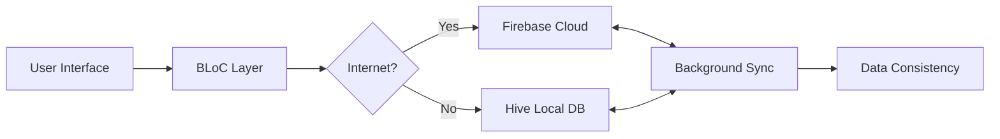

  

  
  
  

---

## ✨ Key Features

  

- 📱 **Universal App** - Mobile & Desktop support
- 🌐 **Smart Sync** - Seamless offline-first architecture
- 🎮 **Real-time UI** - BLoC-powered state management
- 🔄 **CRUD Operations** - Intuitive task management
- 🛡️ **Data Safety** - Hive local storage + Firebase backup
- 🎨 **Pixel-Perfect UI** - Responsive & adaptive design

---

## 🛠️ Tech Stack

| Category          | Technologies                                                                 |
|-------------------|-----------------------------------------------------------------------------|
| **Core Framework**|    |
| **State Mgmt**    |      |
| **Local DB**      |      |
| **Cloud Sync**    |  |
| **UI Toolkit**    |  |

---

## 🚀 Offline-First Architecture

📂 Project Structure
bash
Copy
lib/
├── config/                 # Routing & theme config
├── core/                   # Shared resources
│   ├── constants/          # App constants
│   ├── utils/              # Helper functions
│   └── widgets/            # Reusable components
├── features/               # Feature modules
│   └── tasks/              # Task management
│       ├── data/           # Data layer
│       │   ├── datasources # Local/remote sources
│       │   └── models      # Data models
│       ├── domain/         # Business logic
│       └── presentation/   # UI layer
│           ├── bloc/       # State management
│           └── views/      # Screens
└── injection.dart          # DI configuration